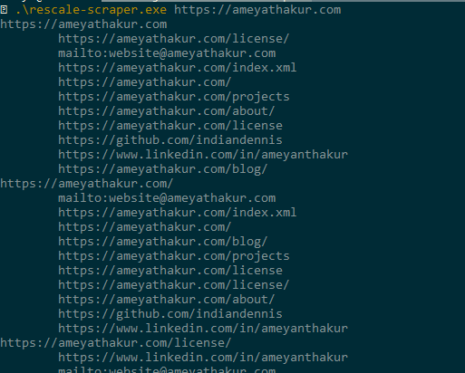

# Rescale Web Scraper Problem

## Usage
`go build`

`./rescale-scraper https://www.rescale.com`

## Notes

This took me around 3 hours. I didn't write any tests because the behavior is
nondeterministic, so any nontrivial tests would be difficult to verify. The behavior can be
tested manually by running it on different websites and checking the output.